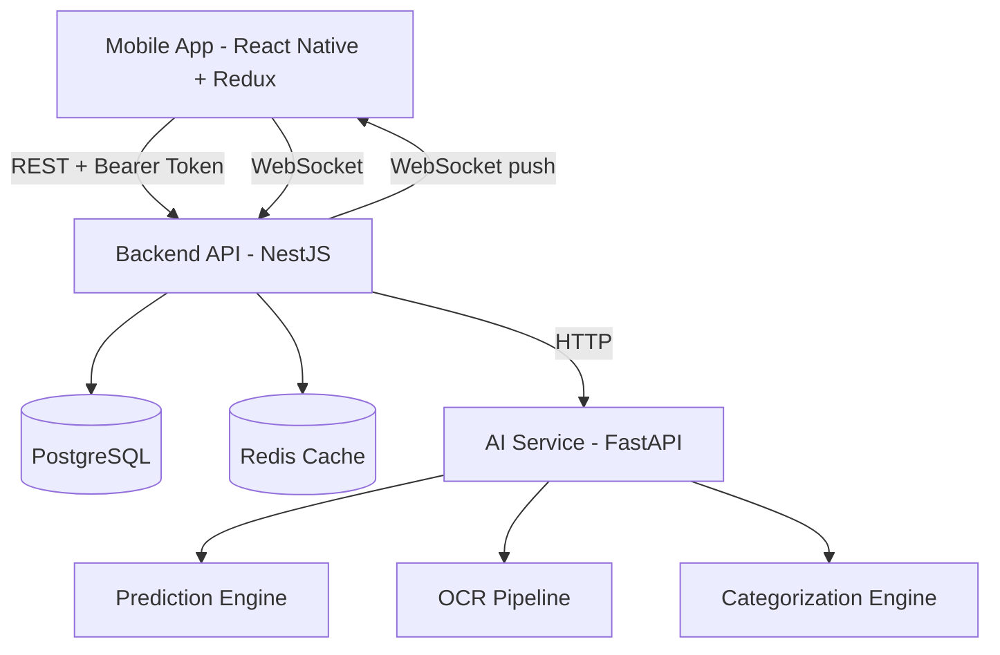
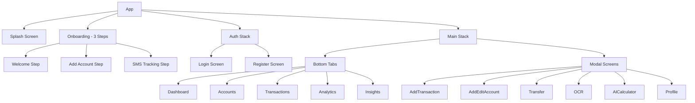
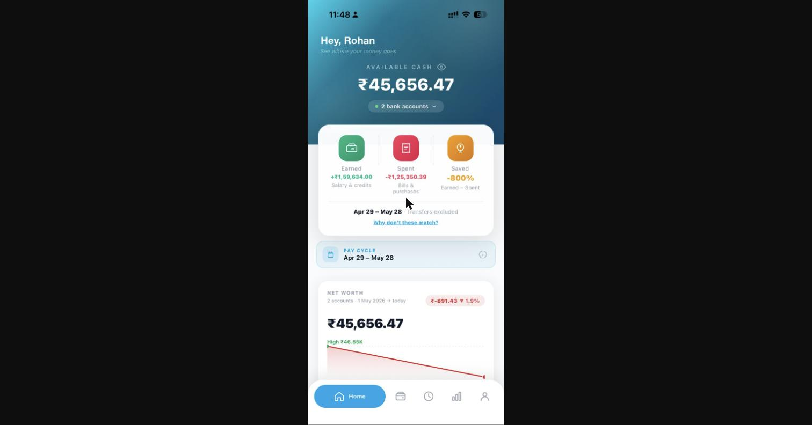
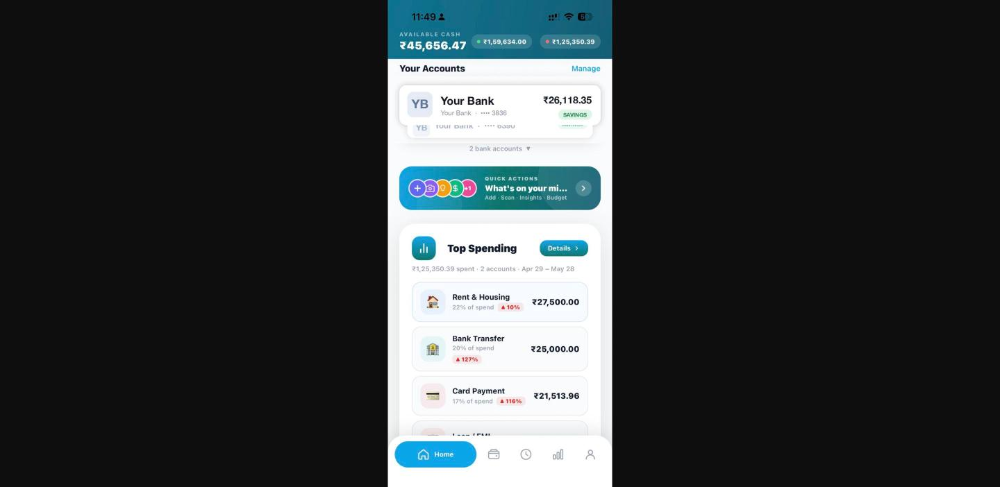
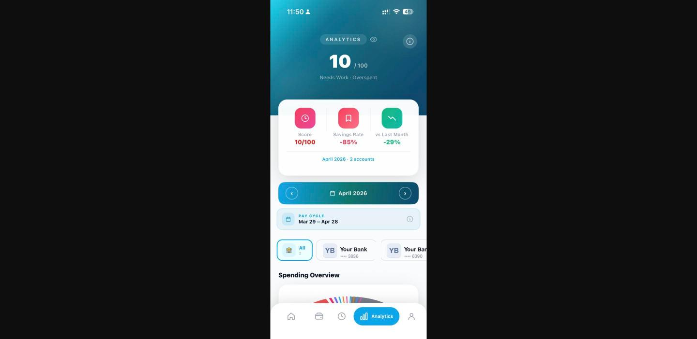
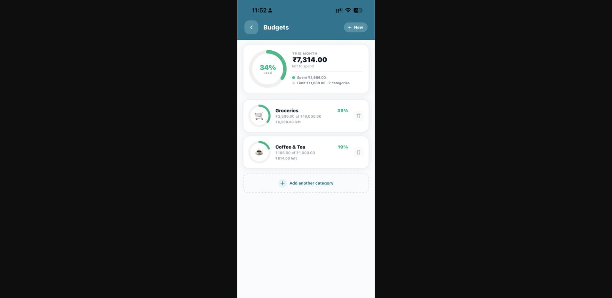
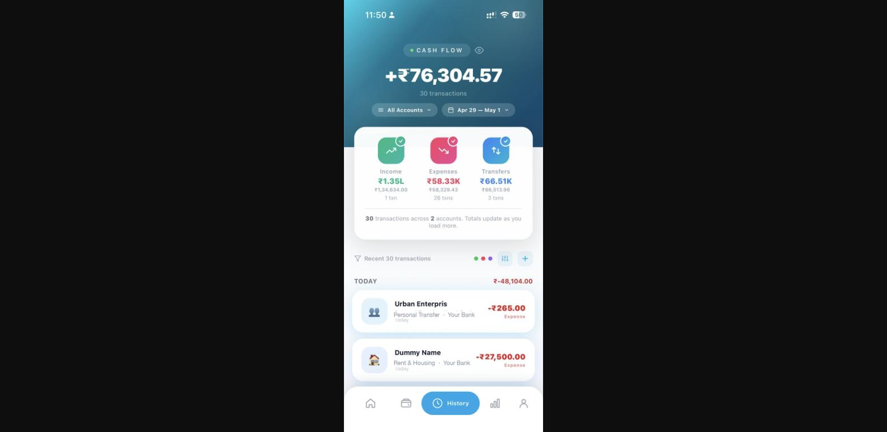
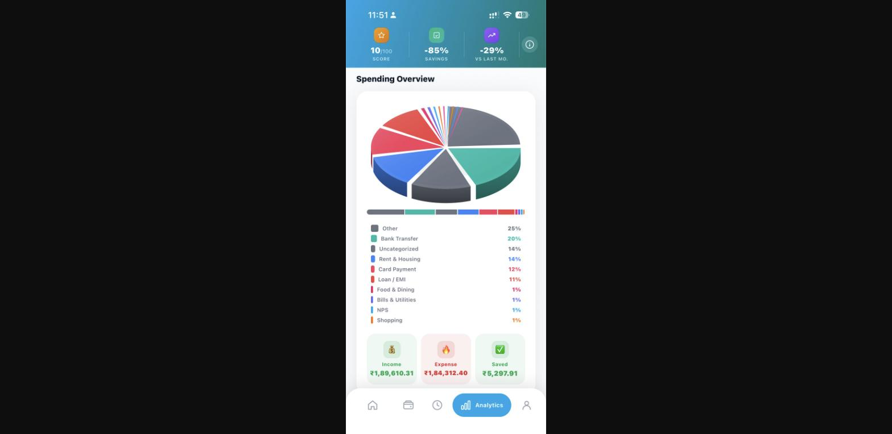
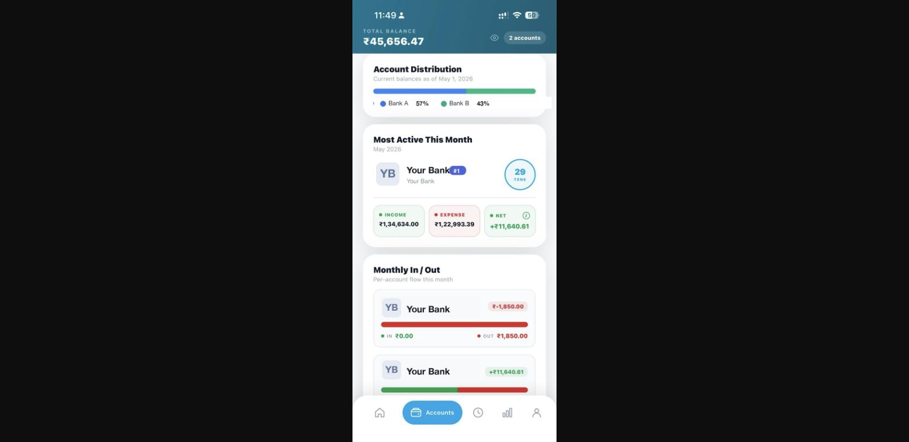
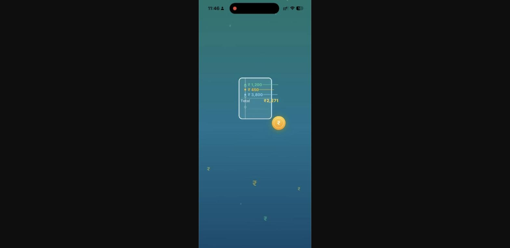

# Expense Intelligence — Public Showcase

This is a public summary repo for a private project. It shares the tech stack and high-level highlights only; no source code is included here.

## Live App / Screenshots

Check out the live app landing page and screenshots here: https://www.spendkar.com/

## About

AI-powered expense tracking app with multi-account support, spending predictions, and financial insights.

## Tech Stack

Mobile: React Native (TypeScript) with Redux Toolkit. Backend: NestJS, TypeORM, and PostgreSQL, with Redis for caching and Socket.io for real-time updates. AI/ML service: Python and FastAPI, using scikit-learn and numpy for predictive analytics and Pytesseract for OCR. Infrastructure: Docker Compose and Nginx, with CI/CD automated through a container registry.

## Key Highlights

The project features a unified transaction categorization engine that combines rules-based matching with AI fallback for PDF, SMS, and manual imports. It includes bank statement OCR parsing supporting over twenty Indian banks using a mix of regex and ML-assisted extraction. Real-time balance updates are delivered via WebSockets, backed by Redis-cached account queries and atomic multi-account transfers. The analytics suite covers spending predictions, subscription detection, and category trend analysis, alongside a client-side AI assistant. The infrastructure is production-hardened with health checks, security headers, and automated CI/CD deployment.

## App Features

The app includes a dashboard with a balance overview, recent transactions, and quick actions; multi-account tracking across checking, savings, credit card, cash, and investment accounts; transaction management with categorization and filtering by date or account; an analytics suite with a spending score, category breakdown, 3D pie charts, and monthly trends; AI insights covering spending predictions, overspending alerts, subscription detection, category trends, and saving suggestions; an AI assistant for natural-language questions about your finances; OCR scanning of receipts and bank statements; transfers between accounts; and theming with dark/light mode across eight accent color palettes.

## Architecture

Expense Intelligence is built as three cooperating services: a React Native mobile app, a NestJS backend API, and a Python FastAPI microservice dedicated to machine learning tasks. The mobile app communicates with the backend over REST for standard operations and over WebSockets for real-time balance and transaction updates, while the backend in turn calls the AI service over HTTP whenever predictions, OCR, or categorization are needed.

The backend is organized into feature modules for authentication, accounts, transactions, transfers, and analytics, all backed by PostgreSQL through TypeORM. Authentication uses JWT tokens validated on every request, and Redis provides a short-lived cache for account data to reduce database load. Multi-account transfers are handled as atomic database transactions so that a debit and credit always succeed or fail together, with real-time balance updates pushed to connected clients afterward.

The AI service focuses on three tasks: forecasting future income, expenses, and balance using simple regression over recent transaction history; extracting transaction details from receipt or bank-statement images via OCR; and automatically categorizing transactions based on their description and merchant. The mobile app also runs a set of lightweight AI-style features entirely on-device, such as spending predictions, overspending alerts, subscription detection, and savings suggestions, so the experience stays useful even if the backend or AI service is temporarily unreachable.

On the mobile side, the app is built with React Native and Redux Toolkit, with dedicated state slices for auth, accounts, transactions, insights, and theming, and a clean separation between UI screens, API/socket services, and reusable components.

### System Flow

  ## Mobile Architecture (React Native)

### Navigation Structure

  ### Redux Store
  
  The Redux store is organized into six slices: auth (token, user profile, login/register/logout), accounts (account list, total balance, CRUD, WebSocket updates), transactions (paginated list, filters, category/trend analytics), insights (AI predictions with a local fallback), theme (dark/light mode and accent color, persisted in AsyncStorage), and onboarding (onboarding state and SMS tracking toggle).
  
  ## App Screenshots

   

   

## Note

The source code for this project is kept in a private repository. This page exists to share the project's architecture and stack publicly without exposing the codebase.
